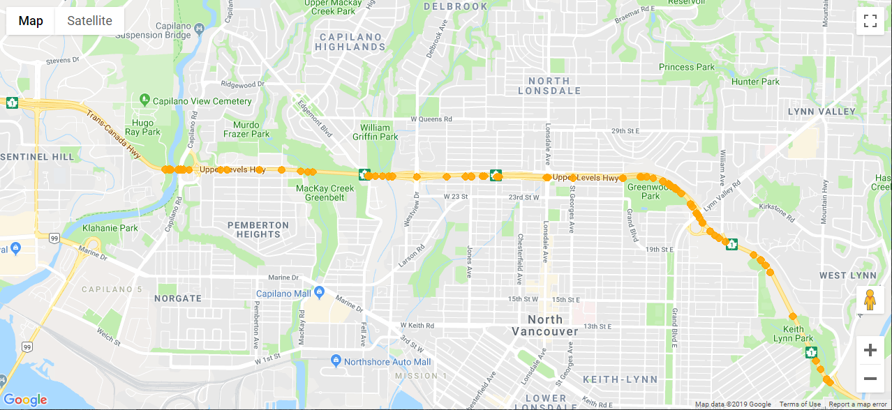

# BC-Traffic-Events-Plot
An Open511 API Event Listener that plots events on a map with Python's gmplot library

Construction events in orange:

Other event types are color-coded accordingly.

### To run:
install gmplot library (pip)

install requests library (pip)

Get Google Maps API key, put it in 'key.txt' in root folder.

